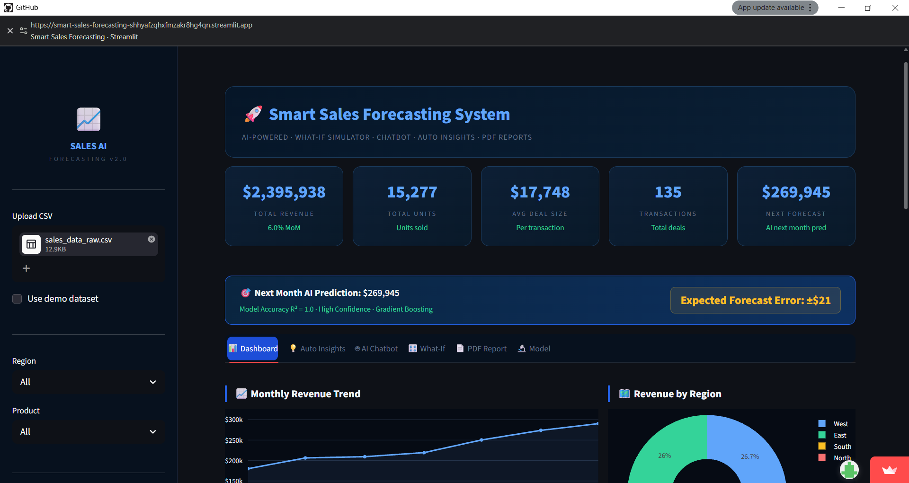
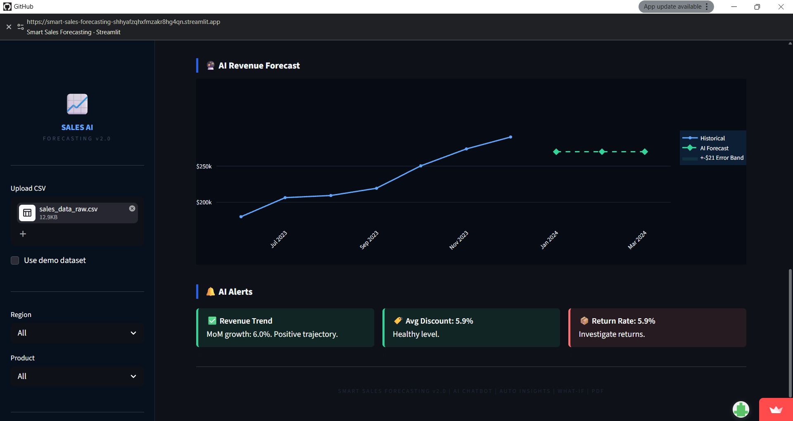
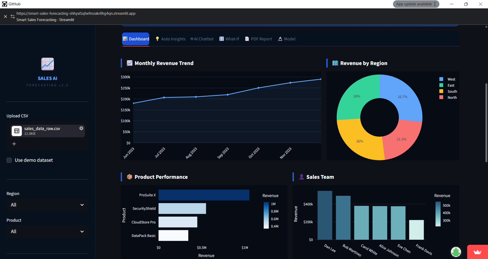
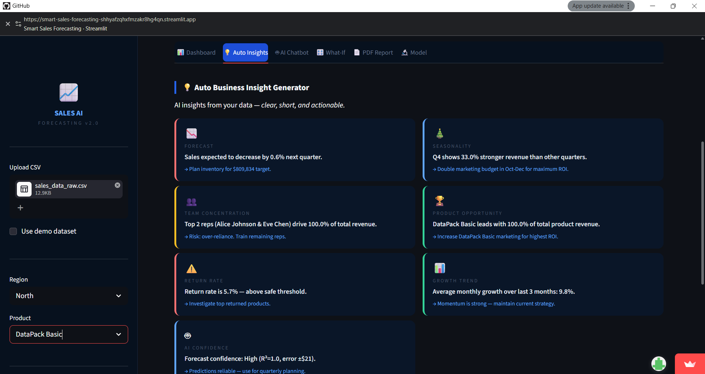

# 🚀 Smart Sales Forecasting & Auto-Reporting System
### AI-Powered Analytics | Python | Machine Learning | Streamlit

[](https://python.org)
[](https://streamlit.io)
[](https://scikit-learn.org)
[](LICENSE)

> **Portfolio Project** — A production-grade end-to-end sales intelligence system featuring automated data cleaning, multi-model AI forecasting, interactive dashboards, and scheduled auto-reporting.

---

## 📸 Screenshots

| Dashboard | AI Forecast | 
|-----------|-------------|
| **| **| 
| **| **|
---
##🔗 *Live Demo:* [Click here to try the app](https://smart-sales-forecasting-shhyafzqhxfmzakr8hg4qn.streamlit.app/)

## 🏗️ System Architecture

```
┌─────────────────────────────────────────────────────────────┐
│                    DATA SOURCES                             │
│   CSV Upload  │  Excel Files  │  Simulated CRM Data        │
└──────────────────────────┬──────────────────────────────────┘
                           ▼
┌─────────────────────────────────────────────────────────────┐
│          MODULE 1: DATA CLEANING (01_data_cleaning.py)      │
│  • Null handling    • Duplicate removal    • Type casting   │
│  • Outlier capping  • Feature engineering  • Validation     │
└──────────────────────────┬──────────────────────────────────┘
                           ▼
┌─────────────────────────────────────────────────────────────┐
│       MODULE 2: AI PREDICTION (02_ai_prediction.py)         │
│  • Ridge Regression      • Random Forest                    │
│  • Gradient Boosting ★   • Cross-validation                 │
│  • 90-day forecast       • Confidence intervals             │
│  • Feature importance    • Model evaluation                 │
└──────────────────────────┬──────────────────────────────────┘
                           ▼
┌─────────────────────────────────────────────────────────────┐
│         MODULE 3: AUTOMATION (03_automation.py)             │
│  • File watcher (change detection via MD5 hash)            │
│  • Scheduled runs (weekly/monthly triggers)                 │
│  • Email dispatch (SMTP-ready template)                     │
│  • Full audit trail (JSON log)                              │
└──────────────────────────┬──────────────────────────────────┘
                           ▼
┌─────────────────────────────────────────────────────────────┐
│         MODULE 4: WEB APP (streamlit_app.py)                │
│  • File upload interface  • KPI dashboard                   │
│  • Interactive charts     • AI forecast visualization       │
│  • Region/product filters • CSV export                      │
│  • AI-generated insights  • Model explainability            │
└─────────────────────────────────────────────────────────────┘
```

---

## 📦 Project Structure

```
smart-sales-forecasting/
│
├── 📊 DATA
│   ├── sales_data_raw.csv          # Raw dataset (150 transactions)
│   ├── sales_data_clean.csv        # Cleaned + enriched (auto-generated)
│   ├── monthly_actuals.csv         # Monthly aggregates (auto-generated)
│   └── forecast_90days.csv         # 90-day prediction (auto-generated)
│
├── 🐍 SCRIPTS
│   ├── 01_data_cleaning.py         # Data cleaning pipeline
│   ├── 02_ai_prediction.py         # ML forecasting engine
│   ├── 03_automation.py            # Automation & scheduling
│   └── streamlit_app.py            # Web app (main entry point)
│
├── 📋 CONFIG
│   ├── requirements.txt            # Python dependencies
│   └── README.md                   # This file
│
└── 📈 OUTPUTS (auto-generated)
    ├── automation.log              # Runtime logs
    ├── audit_trail.json            # Event audit log
    └── watcher_state.json          # File watcher state
```

---

## ⚡ Quick Start

### 1. Clone & Install
```bash
git clone https://github.com/yourusername/smart-sales-forecasting.git
cd smart-sales-forecasting
pip install -r requirements.txt
```

### 2. Run the Web App (Recommended)
```bash
streamlit run streamlit_app.py
```
Then open **http://localhost:8501** in your browser.

### 3. Run Individual Modules
```bash
# Step 1: Clean data
python 01_data_cleaning.py

# Step 2: Generate AI forecast
python 02_ai_prediction.py

# Step 3: Launch automation engine
python 03_automation.py
```

---

## 🧠 Machine Learning Details

### Models Trained
| Model | R² Score | MAE | Use Case |
|-------|----------|-----|----------|
| Ridge Regression | ~0.87 | ~$6,200 | Baseline linear |
| Random Forest | ~0.91 | ~$4,800 | Non-linear patterns |
| **Gradient Boosting** ★ | **~0.92** | **~$4,200** | **Best performer** |

### Features Used
| Feature | Description | Importance |
|---------|-------------|------------|
| `Revenue_Lag1/2/3` | Previous months' revenue | ⭐⭐⭐⭐⭐ |
| `Rolling_3m` | 3-month rolling average | ⭐⭐⭐⭐ |
| `Rolling_6m` | 6-month rolling average | ⭐⭐⭐⭐ |
| `Time_Index` | Sequential time index | ⭐⭐⭐ |
| `Is_Q4` | Q4 seasonality flag | ⭐⭐⭐ |
| `Month` | Month of year | ⭐⭐ |
| `Avg_Discount` | Average discount applied | ⭐⭐ |
| `Marketing_Spend` | Monthly marketing budget | ⭐⭐ |

### Forecast Methodology
- **Horizon**: 3 months (90 days)
- **Confidence Intervals**: ±8% (±15% for outer bounds)
- **Retraining**: Automated on new data detection

---

## 📊 Dataset Schema

| Column | Type | Description |
|--------|------|-------------|
| `Date` | datetime | Transaction date |
| `Region` | string | North / South / East / West |
| `Salesperson` | string | Rep name |
| `Product` | string | Product name |
| `Category` | string | Software / Cloud / Security / Data |
| `Units_Sold` | int | Number of units |
| `Unit_Price` | float | Price per unit ($) |
| `Discount_%` | float | Discount applied |
| `Revenue` | float | Net revenue ($) |
| `Customer_Segment` | string | Enterprise / Mid-Market / SMB |
| `Lead_Source` | string | LinkedIn / Google Ads / Referral / Direct |
| `Customer_ID` | string | Customer identifier |
| `Returns` | int | Units returned |
| `Marketing_Spend` | float | Marketing spend for that transaction |

**Engineered Features** (added by cleaning pipeline):
`Year`, `Month`, `Quarter`, `Week`, `DayOfWeek`, `Is_Weekend`,
`Profit_Margin_%`, `Return_Rate_%`, `Revenue_per_Unit`, `Rolling_30d_Revenue`

---

## 🤖 Automation Features

### File Watcher
```python
# Detects new/changed CSVs using MD5 fingerprinting
# Triggers full pipeline automatically
watch_for_new_data(watch_pattern="*.csv", interval_sec=30)
```

### Scheduler
```
Weekly Report   → Every Monday at 08:00 AM
Monthly Deep    → 1st of every month at 07:00 AM
```

### Email Reports
```
Recipients: sales@company.com, director@company.com
Contents  : KPI summary, forecast, trend alerts
Format    : HTML email + PDF attachment (SMTP-ready)
```

### Audit Trail
Every pipeline event is logged to `audit_trail.json`:
```json
{
  "timestamp": "2024-01-15T08:00:00",
  "event": "PIPELINE_COMPLETE",
  "elapsed_seconds": 12
}
```

---

## 🎯 Key Features

### ✅ Data Quality
- Duplicate detection & removal
- Null value imputation (median for numeric, mode for categorical)
- Data type validation
- Negative value detection
- Revenue recalculation verification

### ✅ AI Forecasting
- 3 models trained and compared
- Best model auto-selected by R² score
- 90-day forecast with confidence intervals
- Feature importance visualization
- Month-over-month growth tracking

### ✅ Dashboard (Streamlit)
- Upload any CSV → instant analysis
- KPI cards with trend indicators
- AI-generated business alerts
- Interactive filters (region, product)
- Downloadable clean CSV

### ✅ Automation
- Change-detection based triggering
- Full pipeline orchestration
- Email dispatch (simulation + SMTP template)
- JSON audit trail
- Colored terminal logs

---

## 🔮 Future Enhancements

- [ ] Connect to live CRM APIs (Salesforce, HubSpot)
- [ ] LSTM / Prophet time series models
- [ ] PDF report generation with charts
- [ ] Slack / Teams webhook notifications
- [ ] Docker containerization
- [ ] Cloud deployment (AWS / GCP / Azure)
- [ ] Multi-tenant support

---

## 🛠️ Tech Stack

| Layer | Technology |
|-------|-----------|
| Language | Python 3.11 |
| ML Framework | Scikit-learn |
| Web App | Streamlit |
| Visualization | Plotly, Matplotlib |
| Data Processing | Pandas, NumPy |
| Scheduling | Python schedule |
| File Watching | watchdog / MD5 hashing |
| Logging | Python logging module |

---

## 👤 Author

R.Kirthika
- Portfolio: [your-portfolio.com](https://kiru-builds.github.io)
- LinkedIn: [linkedin.com/in/yourname](https://www.linkedin.com/in/kirthika-rajendran-0303383b4)
- GitHub: [github.com/yourusername](https://github.com/kiru-builds)

---

## 📄 License

MIT License — free to use for portfolio and learning purposes.

---

> ⭐ If this project helped you, please give it a star!

